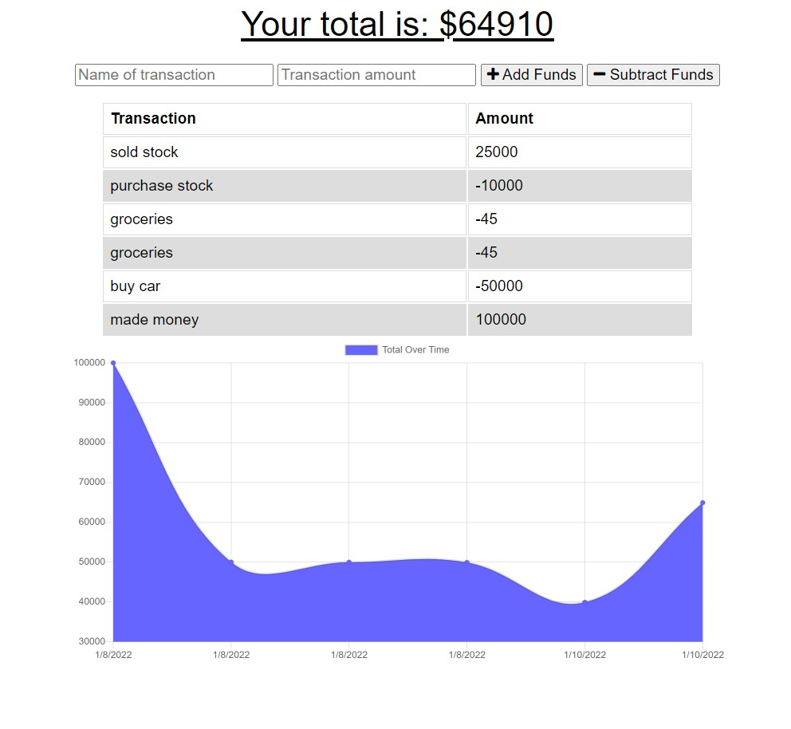

# budget-tracker

## Description 
Budget Tracker is a Progressive Web Application(PWA) that allows users to track their expenses both online and offline.

## Screenshot

## Table of Contents
* [License](#license)
* [Questions](#questions)

## License
🔗https://opensource.org/licenses/MIT

## Questions
Please reach out via email or GitHub with questions or issues.

🔗https://github.com/alexchristianson

📧alex.christianson.05@gmail.com